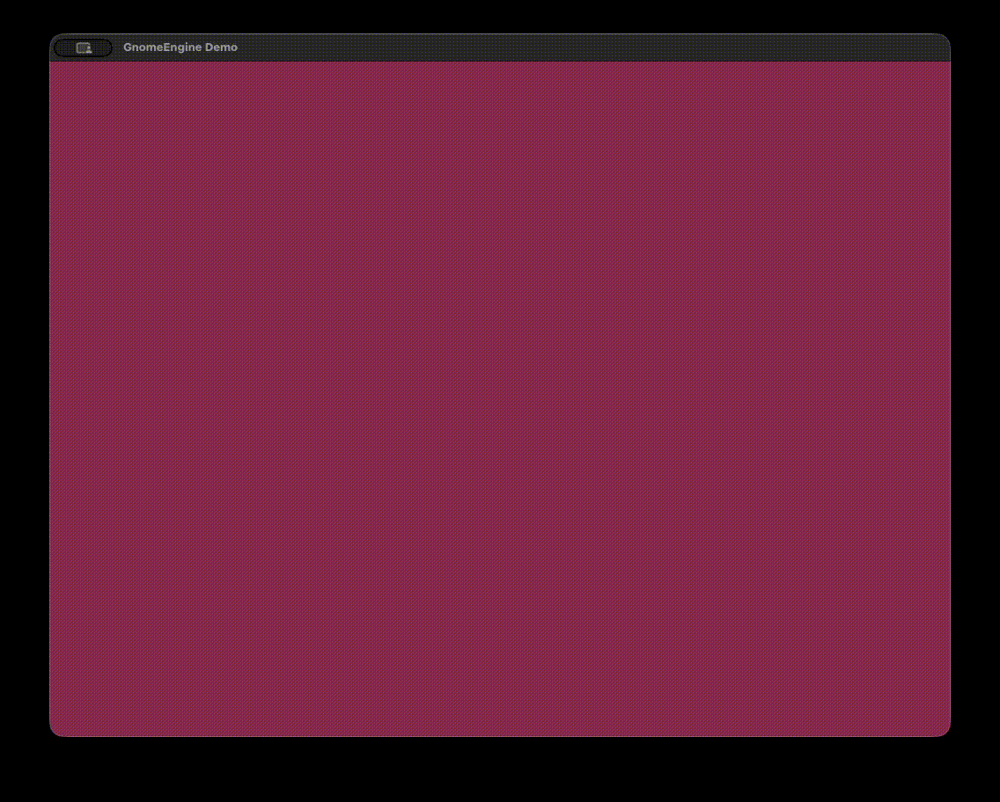

# GnomeEngine

A simple 3D-capable game engine built with **OpenGL** and **C++**, structured as a modular header-only framework.

---

## Sample Usage

`src/main.cpp` — creating a textured rectangle, moving it with the keyboard, and rotating it with mouse drag:

```cpp
#include <iostream>
#include <cmath>

#include "core/GnomeEngine.h"
#include "InputHandler.h"
#include "entities/GRectangle.h"

class Game : public Gnome::GnomeEngine {
  public:
	GRect *my_rect;

  public:
	void setup() {
		my_rect = new GRect(0, 0, 512, 384);
		Gnome::manager->addEntity(my_rect);
		my_rect->material->addTexture("crate.jpg");
	}

	void Render() override {
		// WASD - world-space translation
		if (InputHandler::get().isKeyHeld(GLFW_KEY_A))
			my_rect->transform->translateAbsolute(-0.005f, 0.0f, 0.0f);
		if (InputHandler::get().isKeyHeld(GLFW_KEY_D))
			my_rect->transform->translateAbsolute(0.005f, 0.0f, 0.0f);
		if (InputHandler::get().isKeyHeld(GLFW_KEY_W))
			my_rect->transform->translateAbsolute(0.0f, 0.005f, 0.0f);
		if (InputHandler::get().isKeyHeld(GLFW_KEY_S))
			my_rect->transform->translateAbsolute(0.0f, -0.005f, 0.0f);

		// Left mouse drag - viewport-relative rotation (one axis at a time)
		if (InputHandler::get().isMouseHeld(GLFW_MOUSE_BUTTON_1)) {
			double dx = InputHandler::get().mouseDeltaX;
			double dy = InputHandler::get().mouseDeltaY;
			if (dx != 0.0 || dy != 0.0) {
				if (std::abs(dx) >= std::abs(dy))
					my_rect->transform->rotateAbsolute(5.0f, 0.0f, dx, 0.0f);
				else
					my_rect->transform->rotateAbsolute(5.0f, dy, 0.0f, 0.0f);
			}
		}
	}
};

int main() {
	Game game;
	if (!game.Initialize(1024, 768, "GnomeEngine Demo")) return -1;
	game.setup();
	game.Run();
	return 0;
}
```


---


## Sample Animation Using Shader Textures



## What Is GnomeEngine?

GnomeEngine is a lightweight 3D game engine framework built on **OpenGL 3.3 Core Profile**, using an **Entity-Component System (ECS)** architecture. It is structured as a modular header-only library.

---

## Features

- **Header-only** — include and go, no separate compilation needed
- **Entity-Component System (ECS)** — flexible architecture for attaching components to game objects
- **Transform Component** — supports local and world-space translate, rotate, and scale
  - `translate` / `translateAbsolute` — local vs. world-space movement
  - `rotate` / `rotateAbsolute` — local vs. viewport-relative rotation (like Blender/Unity)
  - `setPosition`, `setRotation`, `setScale` — absolute setters
  - `getPosition`, `getRotation`, `getScale` — state readers
- **Material Component** — texture loading via `stb_image`
- **Shader Component** — built-in default vertex/fragment shaders with model/view/projection uniforms
- **Input Handling** — frame-accurate keyboard and mouse input via `InputHandler` singleton
  - Key states: `Down`, `Held`, `Released`, `Up`
  - Mouse button states with per-frame delta tracking (`mouseDeltaX`, `mouseDeltaY`)
  - Scroll wheel index
- **Built-in Entity: `GRect`** — a textured rectangle with Transform, Shader, and Material pre-attached
- **GLM integration** — matrix math for transforms and projections
- **Delta time** — passed through the update loop for frame-rate-independent logic
- **VSync** — enabled by default
- **macOS (Apple Silicon) support** — tested on M1 with OpenGL 4.1 Metal

---

## Project Structure

```
gnome-engine-opengl-cpp/
├── CMakeLists.txt
├── README.md
├── assets/                         # Runtime assets (textures, etc.)
├── engine/
│   ├── core/
│   │   ├── GnomeEngine.h           # Main engine class (init, loop, shutdown)
│   │   └── types.h                 # Shared types: Vector2, Vector3, Vector4
│   ├── ecs/
│   │   └── ECS.h                   # Entity-Component System base classes
│   ├── components/
│   │   ├── Transform.h             # Position, rotation, scale (local + absolute)
│   │   ├── Material.h              # Texture loading and binding
│   │   └── Shader.h                # GLSL shader compilation and linking
│   ├── entities/
│   │   └── GRectangle.h            # Pre-built textured rectangle entity (GRect)
│   └── input/
│       └── InputHandler.h          # Keyboard + mouse input, per-frame delta
├── src/
│   └── main.cpp                    # Demo application
└── vendor/                         # Third-party libs (GLAD, stb_image, etc.)
```

---

## Dependencies

| Dependency | Purpose |
|---|---|
| **OpenGL** | Rendering |
| **GLAD** | OpenGL function pointer loading |
| **GLFW** | Window management and OS input events |
| **GLM** | Linear algebra / matrix math |
| **stb_image** | Texture loading |
| **CMake** | Build system |

Install on macOS with Homebrew:

```bash
brew install glfw cmake glm
```

---

## Building

```bash
mkdir build && cd build
cmake ..
cmake --build .
./bin/GnomeEngine
```

---

## Controls (Demo App)

| Input | Action |
|---|---|
| `W` / `A` / `S` / `D` | Move rectangle (world-space) |
| Left mouse drag | Rotate rectangle (viewport-relative, one axis at a time) |
| `ESC` | Close window |

---

## Transform API Reference

```cpp
// Local-space (relative to object orientation)
transform->translate(x, y, z);
transform->rotate(angle, x, y, z);

// World-space / absolute (always along screen axes)
transform->translateAbsolute(x, y, z);
transform->rotateAbsolute(angle, x, y, z);

// Absolute setters (resets prior state)
transform->setPosition(x, y, z);
transform->setRotation(angle, x, y, z);
transform->setScale(x, y, z);

// Readers
Vector3 pos = transform->getPosition();
Vector3 rot = transform->getRotation();
Vector3 scl = transform->getScale();
```

---

## InputHandler API Reference

```cpp
InputHandler &input = InputHandler::get();

// Keyboard
input.isKeyDown(GLFW_KEY_A);       // true only on first frame pressed
input.isKeyHeld(GLFW_KEY_A);       // true while held
input.isKeyReleased(GLFW_KEY_A);   // true only on first frame released
input.isKeyUp(GLFW_KEY_A);         // true while not pressed

// Mouse buttons (same state API)
input.isMouseDown(GLFW_MOUSE_BUTTON_1);
input.isMouseHeld(GLFW_MOUSE_BUTTON_1);
input.isMouseReleased(GLFW_MOUSE_BUTTON_1);

// Per-frame mouse movement delta
double dx = input.mouseDeltaX;
double dy = input.mouseDeltaY;

// Cursor position
double x = input.mouseX;
double y = input.mouseY;

// Scroll
double scroll = input.scrollIndex;
```

---

## Roadmap

- [ ] Scene graph / hierarchy
- [ ] Camera as a first-class component
- [ ] Model/mesh loading (OBJ, glTF)
- [ ] Custom shader support
- [ ] Audio system
- [ ] Physics integration
- [ ] Lighting system
